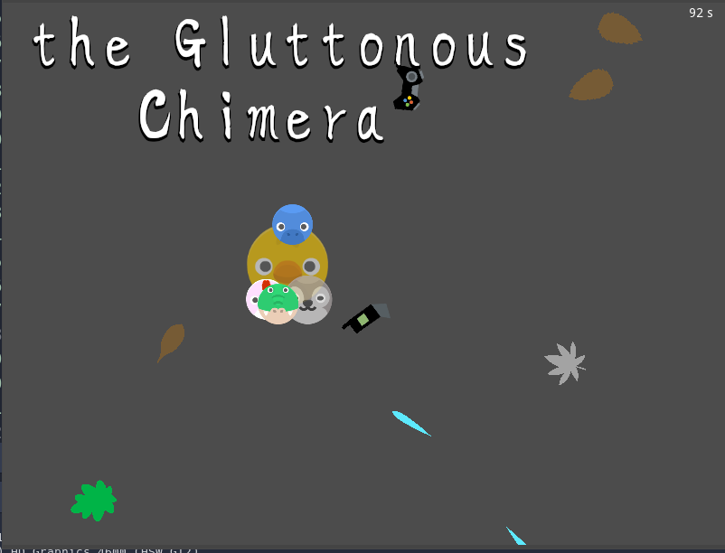

## the Gluttonous Chimera

by Sébastien Abilla (Seb46)

GNU/GPL v3 (voir LICENSE)

#### Jouer en ligne:

[itch.io](https://seb46.itch.io/the-gluttonous-chimera)

#### Description:

* Eat leaves and develop. Avoid being bricked by waste. Stabilize fast enough or ...
* Directionnal arrows to move
* Made for the Kenney Jam 2022
* Tools: Godot 3.5, GIMP 2.10, Firefox 103 under Xubuntu22.04

[Code source](https://github.com/sebabilla/gluttony)

#### Credits

* Images and sounds derived from assets by [Kenney](https://kenney.nl/assets) (CC0)